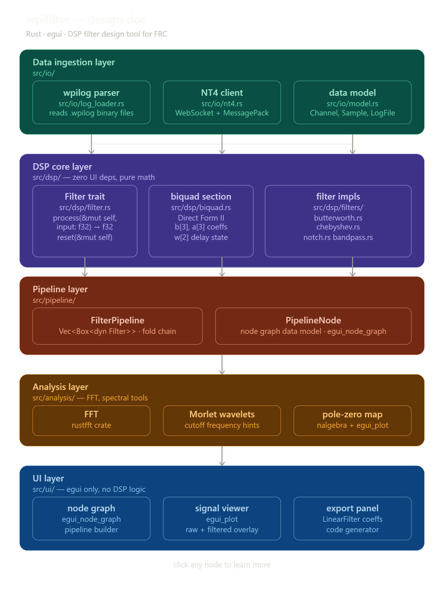

# wpifilter — ROS 2 filter workbench



A desktop filter design + analysis workbench for **ROS 2** signal data — built
for both **simulation** (Gazebo rosbags) and **real robots** (live topics).

Load a rosbag recording (`ros2 bag record`), inspect time-domain / spectrum /
filter-response views, design biquad filters (Butterworth, Chebyshev I,
cookbook LP/HP/BP/notch), wire a node-graph pipeline, and **export the filter
as a ROS 2 node** you can drop straight into your robot or sim workspace.
Or connect live and watch the same views on real topics.

This is a full ROS 2 migration: it reads rosbag2 recordings in the **MCAP**
storage format (the default since ROS 2 Jazzy) and subscribes to live topics
via **rclrs** (the official ros2-rust client). No NetworkTables, no WPILOG.

---

## Feature flags

| Feature  | What it enables                                       | Default |
|----------|-------------------------------------------------------|---------|
| `rosbag` | Offline rosbag2 (MCAP) reading — pure Rust            | ✅ on   |
| `ros2`   | Live ROS 2 topic subscription via rclrs (needs ROS 2) | off     |

```bash
# Offline analysis only (no ROS 2 needed)
cargo build --release

# Live ROS 2 topics (requires a ROS 2 distro, see below)
cargo build --release --features ros2
```

The DSP core, pipeline, GUI, and rosbag reader compile with plain `cargo build`
— no ROS 2 install required. Only the live client needs a ROS 2 environment.

---

## Quick start (offline — simulation)

Record a bag in Gazebo / your sim, or from the robot:

```bash
ros2 bag record -a -o sim_recording
```

(`-a` records everything; since Jazzy this writes an `.mcap` file inside the
`sim_recording` directory. Humble users need the `rosbag2_storage_mcap`
plugin: `sudo apt install ros-humble-rosbag2-storage-mcap`.)

Then:

```bash
cargo run --release -- path/to/sim_recording/sim_recording_0.mcap
```

What you can do in the app:

- **Signal view** — click topics in the left panel; see time traces, spectrum
  (click the spectrum to set the filter cutoff), and filter response.
- **Graph view** — right-click the canvas to add Filter / Sum / Differentiate /
  Gain nodes; wire topic sources (added from the inspector panel) into Output
  sinks and watch the pipeline evaluate live.
- **Export** — enable a filter and hit **Export…** to generate:

  | Tab                  | What you get                                                          |
  |----------------------|-----------------------------------------------------------------------|
  | `filter_chain.yaml`  | YAML params (raw biquad coefficients) for the generated node          |
  | `rclcpp node (C++)`  | Standalone rclcpp filter node: subscribe → cascade → publish          |
  | `rclrs node (Rust)`  | Standalone rclrs filter node (same behavior)                          |
  | `Coefficients`       | Plain-text section coefficients                                       |

  Drop the generated node into a robot or sim package and run it — it
  reproduces exactly what the GUI previewed (causal single-pass; zero-phase
  filtfilt is offline-only).

### Supported rosbag message types

| Type | Extraction |
|------|------------|
| `std_msgs/msg/Float64`, `Float32`, `Int64`, `Int32`, `Bool` | the value |
| `std_msgs/msg/Float64MultiArray` | one signal per element (`data[i]`, capped at 64) |
| `sensor_msgs/msg/Imu` | orientation, angular velocity, linear acceleration components |
| `sensor_msgs/msg/JointState` | position per joint |
| `nav_msgs/msg/Odometry` | pose position/orientation, twist linear/angular |
| `geometry_msgs/msg/Twist`, `TwistStamped` | linear/angular velocity |
| `geometry_msgs/msg/Vector3`, `PointStamped` | x/y/z |

Other types are skipped (listed on the console) — extend the decoder in
`src/io/rosbag_loader.rs` (CDR reader in `src/io/cdr.rs`).

---

## Live ROS 2 topics (real robot or live sim)

Live mode uses **DDS discovery** — set your `ROS_DOMAIN_ID`, pick topics, and
connect. No host/IP box: the robot and this tool just need to be on the same
domain and network.

Live subscriptions are **dynamic** (runtime message introspection via rclrs),
so *any* message type works — scalars (`Float64`, `Bool`, …), IMU, odometry,
multi-arrays — with a dotted **field path** selecting the channel
(e.g. `linear_acceleration.z`, `data[3]`).

### 1. Install ROS 2 + the rclrs build prerequisites

Tested against **Jazzy** (recommended LTS) and **Humble**; `rclrs` 0.7
supports both (plus newer distros). Install ROS 2 per the official docs, then:

```bash
sudo apt install -y git libclang-dev python3-pip

# rclrs issue #557 workaround (see https://github.com/ros2-rust/ros2_rust/issues/557)
sudo apt install -y ros-$ROS_DISTRO-example-interfaces ros-$ROS_DISTRO-test-msgs
```

### 2. Build with the `ros2` feature

```bash
source /opt/ros/jazzy/setup.bash    # your distro
cargo build --release --features ros2
```

`rclrs` comes from crates.io and links against your ROS 2 install — no colcon
workspace or generated message crates needed. (The repo also ships a
`package.xml` if you prefer to build it as a colcon package.)

### 3. Use it

```bash
ros2 run wpifilter wpifilter     # or: target/release/wpifilter
```

- Enter your `ROS_DOMAIN_ID` (default 0).
- **Discover topics** to list everything on the domain (topic + type), or
  type a topic name + type manually.
- Optionally set a **field path** (empty for scalar messages).
- **Connect** — samples stream into a ring buffer and appear in the same
  Signal view / graph pipeline as offline bags.

### Known live-mode limitations

- The live client subscribes with `SensorDataQoS` (best-effort) so it matches
  both best-effort and reliable publishers; message loss is possible under
  load, which is fine for visualization.
- Dynamic message decoding requires the `rosidl_dynamic_typesupport`
  libraries that ship with standard ROS 2 installs (they are pulled in by
  rclrs at runtime).
- Topic discovery is a one-shot DDS query — if a topic is missing, re-press
  **Discover** after the publisher has been up a moment.
- Changing the subscription list requires reconnecting (press **Disconnect**
  then **Connect**).

---

## Tests

```bash
cargo test          # DSP, pipeline, CDR, rosbag round-trip, live store
cargo test --features ros2   # also compiles the rclrs live client (needs ROS 2)
```

The rosbag reader has a self-contained round-trip test: it writes a tiny MCAP
in memory (hand-encoded CDR payloads) and reads it back through the full
loader path — no ROS 2 runtime needed.

---

## Repository layout

```
src/
├── io/
│   ├── model.rs          # protocol-neutral LogFile / Channel / Sample
│   ├── rosbag_loader.rs  # rosbag2 (MCAP) reader + message-type registry
│   ├── cdr.rs            # minimal CDR decoder for ROS 2 payloads
│   ├── live_store.rs     # thread-safe ring buffer (live topics)
│   └── ros2_live.rs      # [ros2] rclrs live subscription client (dynamic messages)
├── dsp/                  # biquad, filter design (RBJ/Butterworth/Chebyshev), ROS 2 export
├── pipeline/             # node-graph dataflow engine (offline analysis)
├── analysis/             # FFT, resampling, sample-rate estimation
└── ui/                   # Signal / Graph / Live (ROS topics) views
```

`package.xml` declares the colcon `cargo` build type so the repo can also be
built as a ROS 2 workspace package (`pip install colcon-cargo
colcon-ros-cargo`, then `colcon build` inside a workspace with the repo in
`src/`).

---

## Roadmap / open questions

- **rclrs distro pinning**: crates.io `rclrs = "0.7"` tracks the ros2-rust
  mainline and supports Humble/Jazzy/newer via the generated bindings. If you
  hit a version mismatch on a specific distro, pin the git dependency
  (`rclrs = { git = "https://github.com/ros2-rust/ros2_rust" }`) — see the
  ros2-rust docs.
- **`rosbag2` (sqlite3) bags**: the old default storage format (pre-Jazzy) is
  not read yet — migrate with `ros2 bag convert` or point MCAP at them.
- **More offline message types**: extend `decode_message` in
  `rosbag_loader.rs`. The live path already handles any type via dynamic
  messages.
